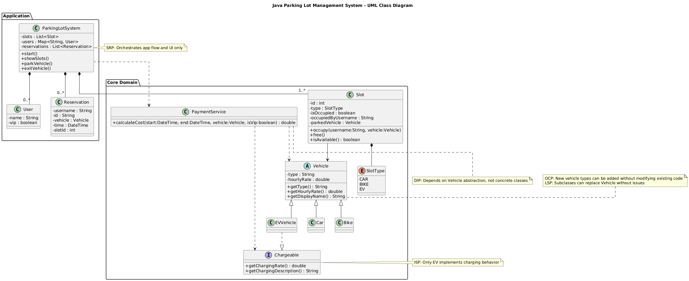
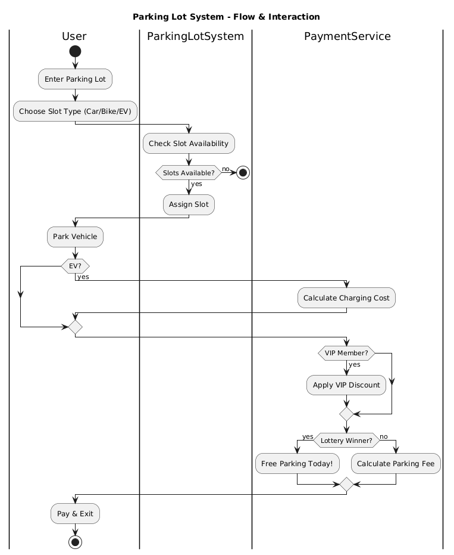

# Parking Lot System

A Java parking lot management system built with SOLID principles.

## Project Structure

**4 Java files:**
- `ParkingLotSystem.java` - Main application (150 lines)
- `Vehicle.java` - Base class with nested vehicle types
- `Slot.java` - Parking slot management  
- `PaymentService.java` - Cost calculation

## Features

- **Vehicle Types**: Car, Bike, Electric Vehicle (EV)
- **Slot Management**: Different slot types for different vehicles
- **User Management**: Registration with VIP/Normal passes
- **Payment System**: Base rates + EV charging + VIP discounts
- **Scheduling**: Future parking reservations
- **Lottery System**: Daily free parking winner
- **Visual Grid**: Color-coded parking lot display

## UML Diagrams

### Class Diagram - System Architecture



The class diagram shows the complete system architecture with:
- **Main Classes**: ParkingLotSystem, Vehicle, Slot, PaymentService
- **Nested Classes**: User, Reservation (within ParkingLotSystem)
- **Vehicle Hierarchy**: Abstract Vehicle class with Car, Bike, EVVehicle subclasses
- **Interface**: Chargeable (implemented by EVVehicle only)
- **Relationships**: Inheritance, composition, dependency, and association
- **SOLID Principles**: Visual representation of how each principle is implemented

### Activity Diagram - System Flow



The activity diagram illustrates the complete user interaction flow:
- **User Entry**: Enter parking lot and choose slot type
- **Slot Allocation**: System checks availability and assigns slots
- **Vehicle Parking**: User parks vehicle in assigned slot
- **Payment Processing**: EV charging calculation, VIP discount application, lottery winner check
- **Exit Process**: Payment and vehicle exit

## SOLID Principles Implementation

### 1. **Single Responsibility Principle (SRP)**
Each class has one clear responsibility.

**ParkingLotSystem.java** - Orchestrates the entire system:
```java
public class ParkingLotSystem {
    private void parkVehicle() { /* handles parking logic */ }
    private void exitVehicle() { /* handles exit logic */ }
    private void scheduleSlot() { /* handles scheduling logic */ }
}
```

**Slot.java** - Manages individual slot state:
```java
public class Slot {
    public boolean isAvailable() { /* slot state management */ }
    public boolean isSuitableFor(Vehicle vehicle) { /* compatibility check */ }
}
```

**PaymentService.java** - Handles cost calculations only:
```java
public class PaymentService {
    public double calculateCost(LocalDateTime start, LocalDateTime end, Vehicle vehicle, boolean isVip) {
        // Payment logic only
    }
}
```

### 2. **Open/Closed Principle (OCP)**
Open for extension, closed for modification.

**Vehicle.java** - New vehicle types can be added without changing existing code:
```java
public abstract class Vehicle {
    // Base class - no changes needed when adding new vehicles
}

public static class Car extends Vehicle { /* existing code unchanged */ }
public static class Bike extends Vehicle { /* existing code unchanged */ }
public static class EVVehicle extends Vehicle { /* existing code unchanged */ }
// New vehicle types can be added here without modifying existing classes
```

**PaymentService.java** - New discount types can be added:
```java
public double calculateCost(...) {
    double baseCost = calculateBaseCost(...);
    if (isVip) baseCost *= 0.8; // VIP discount
    // New discount types can be added here without changing existing logic
    return baseCost;
}
```

### 3. **Liskov Substitution Principle (LSP)**
Subclasses can replace base class seamlessly.

**Vehicle subclasses** - All work with the same parking logic:
```java
// These all work interchangeably:
Vehicle car = new Vehicle.Car();
Vehicle bike = new Vehicle.Bike(); 
Vehicle ev = new Vehicle.EVVehicle();

// Same parking logic works for all:
Slot slot = findSlot(car);    // Works
Slot slot = findSlot(bike);   // Works  
Slot slot = findSlot(ev);     // Works
```

### 4. **Interface Segregation Principle (ISP)**
Small, specific interfaces instead of large ones.

**Chargeable interface** - Only for vehicles that need charging:
```java
interface Chargeable {
    double getChargingRate();
    String getChargingDescription();
}

// Only EV vehicles implement charging:
public static class EVVehicle extends Vehicle implements Chargeable {
    public double getChargingRate() { return 1.0; }
    public String getChargingDescription() { return "EV Charging"; }
}

// Car and Bike don't need to implement unnecessary charging methods
public static class Car extends Vehicle { /* no charging methods */ }
public static class Bike extends Vehicle { /* no charging methods */ }
```

### 5. **Dependency Inversion Principle (DIP)**
Depends on abstractions, not concrete implementations.

**PaymentService** - Depends on Vehicle abstraction:
```java
public class PaymentService {
    public double calculateCost(LocalDateTime start, LocalDateTime end, Vehicle vehicle, boolean isVip) {
        // Works with any Vehicle subclass
    }
}

// Usage - depends on abstractions:
PaymentService payment = new PaymentService();
payment.calculateCost(start, end, new Vehicle.Car(), true);     // Works
payment.calculateCost(start, end, new Vehicle.Bike(), false);   // Works
payment.calculateCost(start, end, new Vehicle.EVVehicle(), true); // Works
```

## Usage

### Compilation
```bash
javac --release 17 -encoding UTF-8 -cp src src/*.java
```

### Running
```bash
java -cp src ParkingLotSystem
```

## Menu Options

1. **View Slots** - Display parking grid with availability
2. **Park Vehicle** - Park a vehicle in suitable slot
3. **Exit Vehicle** - Remove vehicle and calculate cost
4. **Status** - Show occupancy statistics
5. **Register** - Add new user with VIP/Normal pass
6. **Schedule** - Book future parking reservation
7. **View Reservations** - Show scheduled reservations
8. **Exit** - Close the system

## Test Users

- **john** (VIP Pass)
- **jane** (Normal Pass)  
- **bob** (VIP Pass)

## Pricing

Let’s calculate the cost at different time durations (for a non-EV, normal user):

| Time Parked | Seconds | Calculation          | Cost      |
|-------------|---------|----------------------|-----------|
| 5 sec       | 5       | 10 + (0.1 × 5)       | Rs. 10.5  |
| 10 sec      | 10      | 10 + (0.1 × 10)      | Rs. 11.0  |
| 30 sec      | 30      | 10 + (0.1 × 30)      | Rs. 13.0  |
| 1 min       | 60      | 10 + (0.1 × 60)      | Rs. 16.0  |
| 5 min       | 300     | 10 + (0.1 × 300)     | Rs. 40.0  |
| 10 min      | 600     | 10 + (0.1 × 600)     | Rs. 70.0  |
| 30 min      | 1800    | 10 + (0.1 × 1800)    | Rs. 190.0 |
| 1 hour      | 3600    | 10 + (0.1 × 3600)    | Rs. 370.0 |

⚡ For Electric Vehicles (EVs):
An additional charging cost is applied at Rs. 3.00 per hour, calculated per second during parking.
This amount is automatically added to the total parking cost for EVs.

### Design Approach
- **Single main class** handles all system logic
- **Nested classes** for User and Reservation
- 
### Technical Implementation
- **Java 8+ compatibility**
- **ANSI color codes** for visual feedback
- **LocalDateTime** for time handling

## Grid Display

The parking lot is displayed as a color-coded grid:
- **Green**: Available slots
- **Red**: Occupied slots  
- **Blue**: EV slots
- **CAR/BIK/EV**: Vehicle type indicators

```
___|___|___|___
CAR|   |BIK|EV
___|___|___|___
```